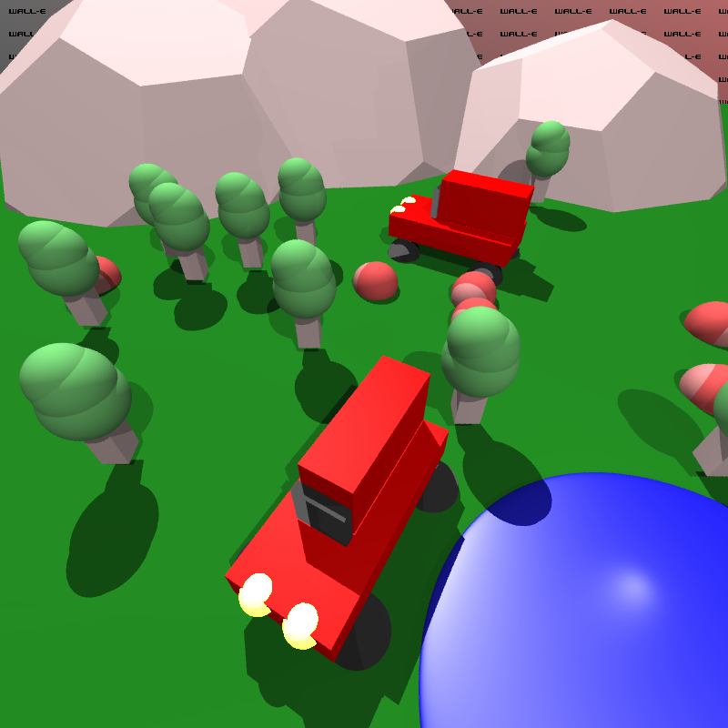

# WALL-E

> A ray-tracer named after one of the most noble robots out there :)

<p align="center">
  
    <p><i><u>sample.py</u>: Two cars surrounded by trees and piles of leaves, in front of a set of large boulders. There's a small and sparkling pond. </i></p>
</p>

### Structure

-   `/wall-e`: The Rust ray-tracing library.
-   `/wall-e-py`: Rust Python3 bindings, for scripting.
-   `/wall-e-py/assets/meshes`: Contains `.obj` mesh files.
-   `/wall-e-py-macros`: Rust macros used in `/wall-e-py`.
-   `/scripts`: Scripts (scenes) you want to render.
-   `/images`: Images from the scenes requested in the assignment guidelines.
-   `SCRIPTING.md`: Documentation for the scripting API.

### Setup

> _Note: You will need to have Rust and Python3 installed on your system._

Create a virtual environment and install `maturin`.

```bash
cd wall-e-py
python3 -m venv .env
source .env/bin/activate
pip install maturin
deactivate
```

### Usage

Scripts, which are python3 files, are put in `/scripts`.

To run a script `./scripts/custom-script.py`, from the root folder, call

```bash
# No debug output.
./run.sh custom-script
# With debug output.
./debug.sh custom-script
```

Or, alternatively:

```bash
cd wall-e-py
source .env/bin/activate
maturin develop
cd ..
python3 ./scripts/custom-script.py
```

Rendered images, by default, are placed in the root folder.

### Dependencies

-   [pyo3](https://github.com/PyO3/pyo3): Interacting with Rust code using Python.
-   `nalgebra`: Linear algebra cratea.
-   `image`: Image processing crate.
-   `lazy_static`: Utility crate for creating global mutable variables with non-const initialization.
-   `obj`: Utility crate for loading `obj` files.
-   [maturin](https://github.com/PyO3/maturin): Building python3 module generated using `pyo3`.
-   `rand`: Utility crate for random number generation.

### Resources

-   https://github.com/amengede/webgpu-for-beginners/tree/main
-   https://cohost.org/mcc/post/1406157-i-want-to-talk-about
-   https://surma.dev/things/webgpu/
-   https://sotrh.github.io/learn-wgpu/#what-is-wgpu
-   https://gpuweb.github.io/gpuweb/
-   https://github.com/gfx-rs/wgpu
